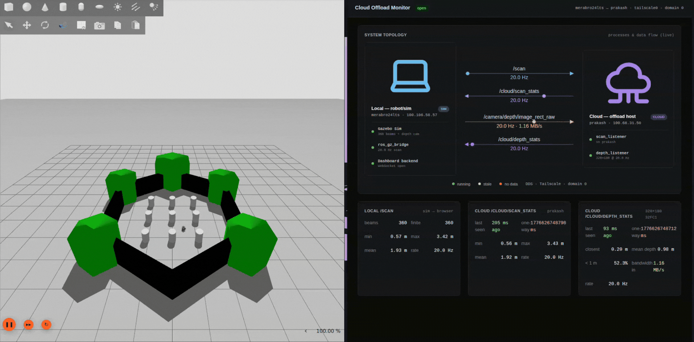
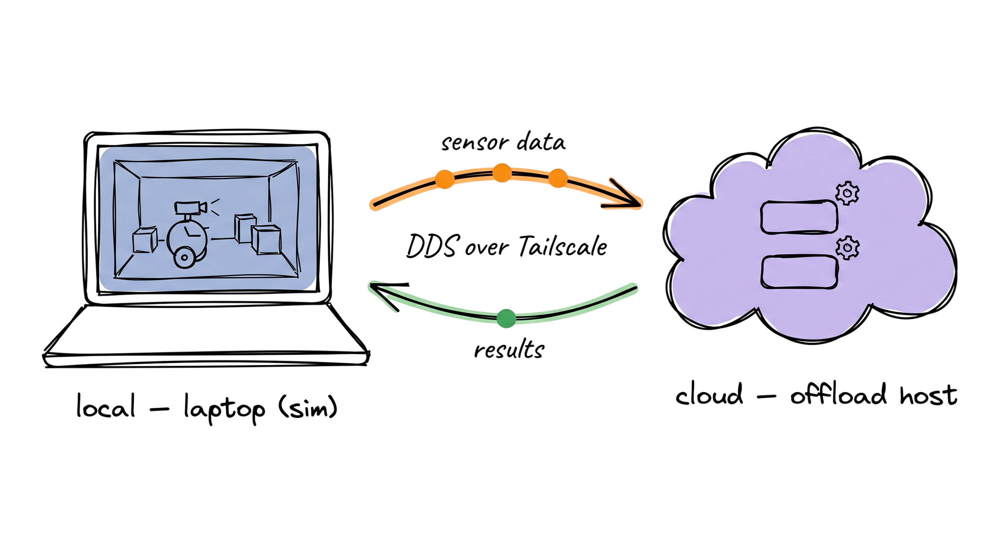

# ros2-cloud-offload

Run a ROS 2 simulation on your laptop, transparently offload one or more
of its nodes to a self-hosted "cloud" machine over a private network, and
watch the data flow live in a browser dashboard.



The example shipped here is a TurtleBot3 burger in Gazebo Sim Harmonic
with a sim'd Intel RealSense D455 depth camera. Two cloud-side nodes
process the bot's `/scan` (lidar) and `/camera/depth/image_rect_raw`
(depth image) and stream summaries back. Everything is wired up so you
can swap in your own offloaded compute (SLAM, perception, planning,
LLM-backed reasoning, …) without changing the topology.

## Status

**Done**

- [x] `LocalMachine` provider — push/build/launch over plain SSH, no AWS/GCP/k8s
- [x] CycloneDDS config rendered from `.env` so peers + interface are not hard-coded
- [x] Tailscale-as-the-private-network path verified end-to-end
- [x] TB3 burger sim in Gazebo Harmonic with the ROBOTIS `turtlebot3_world`
- [x] Sim'd Intel RealSense D455 depth camera on the bot (real D455 mesh vendored)
- [x] Cloud nodes: `scan_listener` (LaserScan stats), `depth_listener` (depth stats + bandwidth)
- [x] FastAPI + rclpy backend with WebSocket fan-out
- [x] React + TypeScript + Chakra UI dashboard with topology view, status dots, eased animated flow arrows
- [x] Multi-stage Dockerfile (Node builds the SPA, ROS Humble runs it)
- [x] All connection details flow from `.env`; nothing about the user's machines is hard-coded

**Planned**

- [ ] Drive the bot from the dashboard (browser-side `/cmd_vel` controls)
- [ ] Swap the demo offload for a heavier real workload (SLAM / perception model / LLM-backed reasoning)
- [ ] Compress depth before publishing (image_transport / draco) so we can scale resolution + rate without saturating the wire
- [ ] Bridge more sensors (IMU stream, RGB camera) and surface them on the dashboard
- [ ] Per-flow latency histograms (p50 / p95 / p99) instead of just a one-way snapshot
- [ ] Multi-cloud / multi-machine offload (more than one `LocalMachine` target in one launch)
- [ ] Graceful reconnection when the cloud machine goes away and comes back
- [ ] Documented "running on real hardware" path (real TB3 or another robot) with the same launch
- [ ] Lightweight auth on the dashboard so it's safe to expose beyond `localhost`
- [ ] CI: build the Docker image and run a no-network smoke test
- [ ] `KubernetesMachine` provider — same `CloudNode(machine=…)` API as `LocalMachine`, but each cloud node lands as a Deployment (or per-launch Job) on a k8s/k3s cluster instead of a single SSH host; auto-discovers via DDS over the cluster's pod network or a shared Tailnet, scales horizontally for replicated workers

## What it looks like



**Reading the diagram, left to right.**

The **laptop** is everything that would run on the robot itself: the
Gazebo Sim Harmonic process (driving a TurtleBot3 burger with a sim'd
RealSense D455 in a small maze), `ros_gz_bridge` (which translates
Gazebo's native topics into ROS 2 sensor messages), and a small FastAPI
backend that subscribes to the live ROS topics and pushes them to the
browser dashboard via WebSocket. Above the laptop is the dashboard
itself — a React + Chakra UI page that renders the same topology you're
looking at, plus live numbers, served from `:8000`.

The two **arrows in the middle** are the actual cross-machine traffic.
The orange one (laptop → cloud) carries the raw sensor topics — `/scan`
(LaserScan, small) and `/camera/depth/image_rect_raw` (a 320×180 float
depth frame, ~1 MB/s sustained). The green one (cloud → laptop) carries
the cheap summaries the cloud computes back: per-frame min/max/mean
ranges, closest-obstacle distance, count of pixels under 1 m. Both
arrows ride **CycloneDDS over Tailscale** — no FogROS2-managed VPN, just
the private network the two boxes already share.

The **cloud** is a self-hosted workstation (any SSH-reachable host) that
runs two purpose-built nodes: `scan_listener` consumes `/scan` and
publishes `/cloud/scan_stats`; `depth_listener` consumes the depth image
and publishes `/cloud/depth_stats`. These two nodes are the "offloaded"
work — in this demo they're tiny numpy reductions, but in a real
deployment they'd be the heavy stuff (SLAM, perception models,
planners) you don't want to run on the robot's onboard SoC.

The whole point of the design: the cloud nodes are **regular ROS 2
subscribers**. They have no idea they live on a different machine. The
launch file just marks them as `fogros2.CloudNode(machine=...)` instead
of `Node(...)`, and the framework handles SSH push, remote build,
remote launch, and DDS plumbing at launch time.

## How the offloading works

Cloud offloading here is built on top of [FogROS2][fogros2]. At launch
time:

1. Your launch file marks specific nodes as `fogros2.CloudNode(machine=…)`
   instead of plain `Node(...)`.
2. A `LocalMachine` (added in this repo) describes a self-hosted SSH
   target — IP, username, key path. No AWS / GCP / k8s — just a host you
   already own.
3. On `ros2 launch`, FogROS2 pickles the cloud nodes, tars the workspace
   `src/` tree, SCPs both to the cloud machine, runs `colcon build` over
   SSH, then launches a generated `cloud.launch.py` that loads the
   pickled nodes there.
4. CycloneDDS is configured on both ends to use the existing private
   network as DDS peers (Tailscale by default), so topics flow
   bidirectionally — local publishers reach cloud subscribers and vice
   versa.

The application code is identical to a normal ROS 2 graph: subscribers
just see topics. Whether the publisher is on the same machine or across
the planet is a launch-time decision.

## Prerequisites

On both the local laptop and the cloud machine:

- A working ROS 2 install (the local side runs in Docker, so really only
  the cloud machine needs ROS Humble installed natively).
- A shared private network. The default config assumes
  [Tailscale](https://tailscale.com); any L3 network where the two boxes
  can route directly will work (set `DDS_INTERFACE` accordingly).
- SSH access from local → cloud with key-based auth (RSA / Ed25519 /
  ECDSA all supported).

On the local laptop only:

- Docker 24+ with the NVIDIA Container Toolkit (for Gazebo's GPU
  rendering — you can drop `--gpus all` if you have no NVIDIA GPU but
  expect lower frame rates).
- An X server (the script mounts `/tmp/.X11-unix` so the Gazebo GUI
  appears on your host).

## Setup

```bash
git clone https://github.com/prakash-aryan/ros2-cloud-offload.git
cd ros2-cloud-offload

# 1. Configure for your two machines.
cp .env.example .env
$EDITOR .env

# 2. Build the local-side dev image (multi-stage: Node builds the React
#    SPA, then ROS Humble + Gazebo Harmonic + the FastAPI backend land
#    on top).
docker build -t fogros2-local -f Dockerfile.local .
```

The required `.env` values:

| Variable | What it is |
|---|---|
| `LOCAL_IP`        | This laptop's IP on the shared network (e.g. its Tailscale IP). |
| `CLOUD_IP`        | Cloud machine's IP on the shared network. |
| `LOCAL_HOSTNAME`  | Display label only. |
| `CLOUD_HOSTNAME`  | Display label only. |
| `CLOUD_SSH_HOST`  | Hostname / IP used for the SSH connection (often the same as `CLOUD_IP`, or a Tailscale MagicDNS name). |
| `CLOUD_USER`      | SSH login user on the cloud machine. |
| `SSH_KEY_PATH`    | Private key on the host (e.g. `~/.ssh/id_ed25519`). |
| `DDS_INTERFACE`   | The interface on which both machines route to each other (`tailscale0`, `wg0`, `eth0`, …). |
| `ROS_DOMAIN_ID`   | Standard ROS 2 — defaults to 0. |

Nothing in the source tree hard-codes machine identity; everything
flows from `.env`.

## Run

```bash
./run_local.sh
# now inside the container:
colcon build --symlink-install
source install/setup.bash
ros2 launch fogros2_examples tb3.local_machine.launch.py
```

What you get:

- A Gazebo Sim Harmonic window with the TurtleBot3 burger sim and the
  RealSense D455 mounted on its front, in the ROBOTIS `turtlebot3_world`
  maze.
- The two cloud nodes pushed to the workstation, built there, running
  there.
- A browser dashboard at <http://localhost:8000> showing the topology and
  live data flow.

To drive the bot from another terminal:

```bash
docker exec -it fogros2-local bash -c "
  source /opt/ros/humble/setup.bash &&
  source install/setup.bash &&
  ros2 topic pub --rate 10 /cmd_vel geometry_msgs/msg/TwistStamped \
    '{twist: {linear: {x: 0.15}, angular: {z: 0.3}}}'"
```

To shut everything down:

```bash
docker kill fogros2-local
ssh "${CLOUD_USER}@${CLOUD_SSH_HOST}" \
  'pkill -9 scan_listener; pkill -9 depth_listener; pkill -9 -f cloud.launch'
```

## Repository layout

```
fogros2/                     # FogROS2 framework (forked, trimmed; LocalMachine
                             # provider + Tailscale-friendly DDS config added)
fogros2_examples/
  fogros2_examples/
    scan_listener.py         # cloud node: laser stats
    depth_listener.py        # cloud node: depth stats (numpy on raw frame)
  launch/
    talker.local_machine.launch.py   # minimal pipe demo
    tb3.local_machine.launch.py      # the full TB3 + dashboard demo
  models/                    # vendored TB3 burger + turtlebot3_world + D455
  worlds/                    # turtlebot3_world.world
  params/                    # ros_gz_bridge mapping yaml
dashboard/
  backend/main.py            # FastAPI + rclpy → WebSocket fan-out + SPA host
  frontend/                  # React + TypeScript + Vite + Chakra UI
Dockerfile.local             # multi-stage: node builds SPA, ROS image runs it
cyclonedds_local.xml.template# DDS config rendered from .env at run time
run_local.sh                 # entry point — loads .env, renders config, runs Docker
.env.example                 # all per-deployment settings live here
```

## Writing your own offloaded node

Three steps:

1. Write a normal ROS 2 node. Don't think about the network at all.
2. In your launch file, instantiate it as a `fogros2.CloudNode(...)`
   instead of `Node(...)`, and pass the shared `fogros2.LocalMachine`
   instance:

   ```python
   import fogros2

   def generate_launch_description():
       ld = fogros2.FogROSLaunchDescription()
       machine = fogros2.LocalMachine(
           ip=os.environ["CLOUD_IP"],
           ssh_username=os.environ["CLOUD_USER"],
           ssh_key_path=os.environ["CLOUD_SSH_KEY"],
           local_ip=os.environ["LOCAL_IP"],
       )
       ld.add_action(fogros2.CloudNode(
           package="my_pkg", executable="my_heavy_node",
           machine=machine,
       ))
       return ld
   ```
3. Surface its outputs on the dashboard, if you want. Have your cloud
   node also publish a small `std_msgs/String` JSON heartbeat to
   `/cloud/<your_topic>_stats`, then add a subscription in
   `dashboard/backend/main.py` and a panel in
   `dashboard/frontend/src/components/`.

## Troubleshooting

**Cloud-side stats topics not arriving on the dashboard.** Almost always
a network-fragmentation issue. Tailscale's MTU is 1280, so any DDS
message that fragments at the IP layer can lose packets and starve other
topics on the same link. Keep raw image / pointcloud rates down, or
pre-process before publishing.

**`error creating node: rcl node's rmw handle is invalid` on the cloud.**
Stale ROS processes on the cloud holding domain-0 participant slots.
Run `ssh "${CLOUD_USER}@${CLOUD_SSH_HOST}" pkill -9 -f fogros2_examples`.

**Gazebo opens but nothing renders.** Either no `--gpus all` (the
container's `nvidia` runtime), or your X server isn't reachable. Run
`xhost +local:root` once on the host before `./run_local.sh`.

**Permission denied on cloud rebuild.** The local container builds with
`--symlink-install`; symlinks point inside the container. Don't push
`build/` or `install/` to the cloud — `LocalMachine.push_ros_workspace()`
already only tars `src/`.

## Acknowledgments

This project would not exist without the work of others. We extend, vendor,
or build on top of:

- **[FogROS2][fogros2]** — Berkeley Automation Lab. The core launch-time
  cloud-deployment machinery (`FogROSLaunchDescription`, `CloudNode`,
  `CloudInstance` base class) is from FogROS2; we added a `LocalMachine`
  provider, removed the AWS/GCP/Kubernetes paths we didn't need, and
  tweaked the DDS config flow to skip WireGuard when the link is already
  private. Apache 2.0.

- **[turtlebot3_simulations][tb3sim]** (jazzy branch) — ROBOTIS. The
  TurtleBot3 burger SDF, the maze world, the URDF, the bridge yaml, and
  several mesh files under `fogros2_examples/models/` are vendored from
  this repository. Apache 2.0.

- **[realsense-ros][rsros]** (Intel) — the Intel RealSense D455 visual
  mesh under `fogros2_examples/models/realsense_d455/meshes/d455.stl` is
  the official mesh from Intel's ROS package. Apache 2.0.

- **[Gazebo Sim Harmonic][gz]** (Open Robotics), **[Tailscale][ts]**,
  **[CycloneDDS][cdds]**, **[FastAPI][fa]**, **[React][rx]**, and
  **[Chakra UI][cu]** for the rest of the stack.

[fogros2]: https://github.com/BerkeleyAutomation/FogROS2
[tb3sim]: https://github.com/ROBOTIS-GIT/turtlebot3_simulations
[rsros]:  https://github.com/IntelRealSense/realsense-ros
[gz]:     https://gazebosim.org/
[ts]:     https://tailscale.com/
[cdds]:   https://cyclonedds.io/
[fa]:     https://fastapi.tiangolo.com/
[rx]:     https://react.dev/
[cu]:     https://chakra-ui.com/
